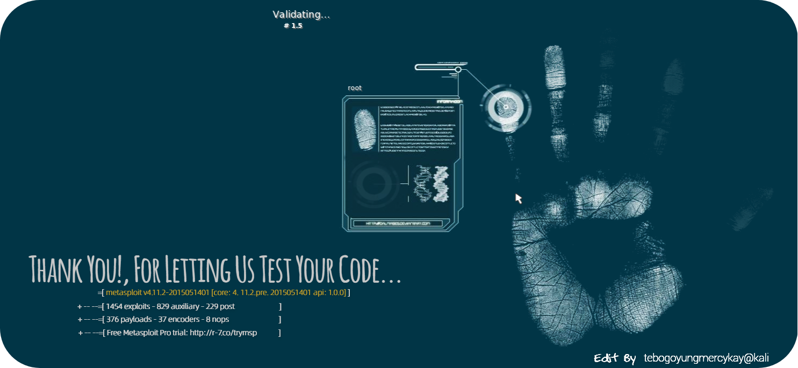

<h1 align="center">
  
</h1>



---

<h1 align=center>Personal Profile</h1>

As a Software Developer with experience in AWS Cloud Development, Full-Stack Development, DevOps, Database Management, and Testing, I apply my problem-solving skills to address real-world challenges. My interest in Cyber Security and Ethical Hacking has broadened my knowledge and skills, enabling me to deliver secure digital solutions. I'm also intrigued by Data Science, where I use data to derive valuable insights and inform decisions. Outside of technology, I engage in chess, art, and design, which contribute to my strategic thinking and creativity. My diverse interests and expertise allow me to make a meaningful impact through innovative solutions. This diverse skill set makes me a valuable addition to any team, ready to contribute and learn in a dynamic environment.

Additionally, as a STARS Mentor at the University of Pretoria, I guide and inspire aspiring minds on their educational and professional journeys. As Martin Luther King, Jr. once said, "Life's most persistent and urgent question is, what are you doing for others?" Mentoring is a way to contribute to others by dedicating yourself to your mentee's well-being. Since I enrolled in the STARS mentorship, I have a better appreciation for the importance of mentorship.

---

<h1 align=center>Professional Skills</h1>

```python
import json

proficient_json = json.dumps({
    "Languages": ["C++", "Java", "Python", "JavaScript", "C#", "PHP", "Node.js", "Typescript"],
    "Front-End  Tools": [
        "Angular", "React", "Ionic", "Bootstrap",
        "jQuery", "NextJS", "Tailwind CSS"
    ],
    "Back-End Tools": ["Node.js", "Express.js", "Django", "FastAPI", "Flask"],
    "Web Technologies": ["JSON", "AJAX", "HTML & CSS", "Markdown", "Socket.io"],
    "Databases": ["MySQL", "MongoDB", "NeDB", "PostgreSQL", "Microsoft SQL Server"],
    "AWS Services": [
        "AWS", "S3 Bucket", "DynamoDB", "AWS Lambda", "XRAY",
        "API Gateway", "AWS Elastic Beanstalk", "Amazon EC2",
        "AWS CloudFormation", "AWS IAM (AWS Identity and Access Management)"
    ],
    "Development Tools": [
        "phpMyAdmin", "Docker", "Continuous Integration and Continuous Delivery (CI/CD)",
        "CircleCI", "SSMS"
    ],
    "Terminals": ["CMD", "Kali Linux", "Bash", "WSL", "PowerShell", "Ubuntu"],
    "Web Frameworks": ["Django", "Flask", "Node.js with Express", "PHP"]
}, indent=4)
```

<h4 align=center>Create a Todo. Serverless.</h4>
                                                   
```typescript
async createToDo(todoItem: TodoItem): Promise<TodoItem>{
        console.log("Creating new todo");
        const params = { 
            todo_Table: this.todosTable, 
            Item: todoItem,
        };
        const result = await this.documentClient.put(params).promise();
        logger.info('User created a todo', {result})
        return todoItem as TodoItem;
}
```


<a></a>
<a></a>

---

<h1 align=center>Contact Details</h1>

- WhatsApp/Mobile: +27 66 411 0178
- Email: sbkskhalo.kq@gmail.com
- `LinkedIn Profile`: [sello-selepe](https://www.linkedin.com/in/sello-selepe-tebogoyungmercykay/)

---
