---
[)](https://git.io/typing-svg)
---
<p align=center></p>
<!-- <p align=center><br></p> -->

# <p align=center>Personal Profile</p>

I am a Full Stack Developer, Cloud Developer and Mentor at the University of Pretoria (STARS Mentorship). Some of my skills include communicating effectively, computing, and Mathematical Modelling. Passionate about Chess, art, and design, I am also goal-oriented and result-oriented. 

- I am a punctual and motivated individual who is able to work in a busy environment and produce high standards of work.
- I am an excellent team worker and am able to take instructions from all levels and build up good working relationships with everyone I work with.
- I also work well on my own as I like to set myself goals which I will achieve. 
- I have good listening and communication skills. I have a creative mind and am always up for new challenges.
- I am well organized and always plan ahead to make sure I manage my time well.
---
## SKILLS
- Proficient languages and Frameworks
  - C++, Java, Python, C#, JavaScript, PHP, NodeJS , Typescript, AngularJS, JSON, Bootstrap, HTML & CSS, SQL. MODERATE: React, Ionic and AJAX.
  - Repositories Where The Languages Are Put To Use:
    - C++:
      - [Basic Puzzle Survival Game: Runs on Terminal](https://github.com/TebogoYungMercykay/Basic_Puzzle_Survival_Game_In_CPP.git)
      - [Towers Of Hanoi: Recursion And STL Stacks](https://github.com/TebogoYungMercykay/Towers_Of_Hanoi----Recursion_And_STL_Stacks.git)
      - [Procedural Programming](https://github.com/TebogoYungMercykay/CPP---Procedural-Programming.git)
      - [Object Orientated Programming](https://github.com/TebogoYungMercykay/CPP---Object-Orientated-Programming.git)
    - Java:
      - [Relational Database Using Self-Organising Treaps](https://github.com/TebogoYungMercykay/Relational-Database_Using_Self-organizing_Treaps/tree/main)
      - [Sudoku Puzzle Solver: 3D Sparce Tables & Linked Lists](https://github.com/TebogoYungMercykay/Sudoku-Puzzle-In-Java__Sparce-Tables.git)
      - [Binary Search Tree: Simple Travesals and Recursion](https://github.com/TebogoYungMercykay/Binary-Search-Tree--Simple-Travesals--and-Recursion.git)
      - [Data Structures and Algorithms](https://github.com/TebogoYungMercykay/Java---Data_Structures_And_Algorithms-.git)
      - [Hash Table and Hash Functions](https://github.com/TebogoYungMercykay/Hash_Functions/tree/main)
    - PHP:
      - [The Complete Web Development Practice Space](https://github.com/TebogoYungMercykay/The-Complete-Web-Development-Practice-Space.git)
      - [COS221 Practical 5, Group: The Untouchables](https://github.com/TebogoYungMercykay/FullStack---COS221_Practical_5_Group_The_Untouchables.git)
    - Python 3: [Jupyter Notebook](https://github.com/TebogoYungMercykay/Python_Codes_for_Mathematical_Problem_Solving.git)
    - JavaScript:
      - [The Complete Web Development Practice Space](https://github.com/TebogoYungMercykay/The-Complete-Web-Development-Practice-Space.git)
      - [COS221 Practical 5, Group: The Untouchables](https://github.com/TebogoYungMercykay/FullStack---COS221_Practical_5_Group_The_Untouchables.git)
      - [The Brand Race Game Loop and Client Side](https://github.com/TebogoYungMercykay/The_Brand_Race.git)
    - C#: [Windows Forms App, .Net Framework](https://github.com/TebogoYungMercykay/CSharp---Windows_Forms_App.git)
    - Typescript, Ionic and NodeJs:
      - [The_Brand_Race_Local_NodeJs_Socket_Server](https://github.com/TebogoYungMercykay/The_Brand_Race.git)
      - [Cloud Dev Project 4](https://github.com/TebogoYungMercykay/Project-4---Building-Serverless-Project-in-Aws.git)
      - [Cloud Dev Project 3](https://github.com/TebogoYungMercykay/Project-3---Refactor-Monolith-to-Microservices-and-Deploy.git)
      - [Cloud Dev Project 2](https://github.com/TebogoYungMercykay/Project-2---Image-Filter-Microservice.git)
    - Angular:
      - [Ionic_Angular_Native_Mobile_Application](https://github.com/TebogoYungMercykay/Ionic_Angular_Native_Mobile_Application.git)
      - [Angular Web App - Frontend](https://github.com/TebogoYungMercykay/FrontEnd---Angular-Web-App-Monkey-And-River_Hackathon.git)
    - JSON:
      - [The Complete Web Development Practice Space](https://github.com/TebogoYungMercykay/The-Complete-Web-Development-Practice-Space.git)
      - [Bad: Straw Hats Heritage Hackathon](https://github.com/TebogoYungMercykay/The_Straw_Hat_Heritage_Hackathon.git)
    - HTML & CSS:
      - [The Complete Web Development Practice Space](https://github.com/TebogoYungMercykay/The-Complete-Web-Development-Practice-Space.git)
      - [For Fun: Simple Web App](https://github.com/TebogoYungMercykay/Simple_Web_App.git)
    - Bootstrap: [The Complete Web Development Practice Space](https://github.com/TebogoYungMercykay/The-Complete-Web-Development-Practice-Space.git)
    - [Load More](https://github.com/TebogoYungMercykay?tab=repositories)
- Operating Systems:
  - Linux
  - Windows 
- Terminals:
  - CMD
  - Bash
  - WSL
  - PowerShell
  - Ubuntu
  - Many more.... 
- databases and Tools
  - Learned from School: phpMyAdmin and MySQL.
  - Additional: MongoDB, NeDB and PostgreSQL.
#### <p align=center>Create a Todo. Serverless.</p>
```typescript
  async createToDo(todoItem: TodoItem): Promise<TodoItem>{
        console.log("Creating new todo");
        const params = { 
            todo_Table: this.todosTable, 
            Item: todoItem,
        };
        const result = await this.documentClient.put(params).promise();
        logger.info('User created a todo', {result})
        return todoItem as TodoItem;
  }
```
---
  ## Studies
- I'm currently studying Computer Sciences @ The University Of Prtetoria(UP)
- I also completed the AWS Cloud Development Nanodegree Program by Udacity (ALX).
  - Certificate: [Cloud Developer](https://graduation.udacity.com/confirm/42RW4A3C)
  - Project 1: [Deploy A Static Website On AWS](https://github.com/TebogoYungMercykay/Project-1---ALX-T-Cloud-Developer---Deploy-Static-Website-on-AWS.git)
  - Project 2: [Udagram Image Filtering Microservice Project](https://github.com/TebogoYungMercykay/Project-2---Image-Filter-Microservice.git)
  - Project 3: [Refactor A Monolith To Microservices and Deploy](https://github.com/TebogoYungMercykay/Project-3---Refactor-Monolith-to-Microservices-and-Deploy.git)
  - Project 4: ["TODO" Application using AWS Lambda and Serverless Framework](https://github.com/TebogoYungMercykay/Project-4---Building-Serverless-Project-in-Aws.git) 
  - Resources: [Udacity/Cloud Developer](https://github.com/udacity/cloud-developer.git)

---
## Employment
- Computer Laboratory Technician
- Part-Time at the Mamelodi IT Labs (University of Pretoria)
- Skills Used:
  - Software Installation
  - Hardware Installation
  - Computer Hardware Assembly
  - LCD Projectors
  - Live Casting
  - Sever Casting
  - Microsoft Office
---
## Contacts
- WhatsApp/Mobile: +27 66 411 0178
- Email: sbkskhalo.kq@gmail.com
- LinkedIn Profile: [sello-selepe](https://www.linkedin.com/in/sello-selepe-tebogoyungmercykay/)
---
## Links
- Trading: [BabyPips](https://www.babypips.com/learn)
- The CS50: [YouTube](https://www.youtube.com/@cs50)
- Chess.com: [My Chess.com Account](https://www.chess.com/member/yungmercykay)
- Lichess.org: [My Lichess.org Account](https://lichess.org/@/UberKidmodeEats)
- Chess Network: [YouTube](https://youtube.com/playlist?list=PLQsLDm9Rq9bHKEBnElquF8GuWkI1EJ8Zp)
- Online Compiler: [GDB-Compiler](https://www.onlinegdb.com/online_java_compiler)
- Crash Course Computer Sciences: [YouTube](https://youtu.be/tpIctyqH29Q)
- ### Some Resources:
  - STACK OVERFLOW: [Where Developers Learn, Share, & Build Careers](https://stackoverflow.com/)
  - MDN Web Docs: [developer.mozilla](https://developer.mozilla.org/en-US/docs/Web)
  - W3Schools: [Tutorials Dropdown](https://www.w3schools.com/)
  - Bootstrap: [v5.3](https://getbootstrap.com/)
  - PHP Documentation: [Manual in English](https://www.php.net/manual/en/)
  - .Net: [Documentation](https://learn.microsoft.com/en-us/dotnet/)
  - Font Awesome: [Icons](https://fontawesome.com/v4/icons/)
  - CodePen: [Online Editor](https://codepen.io/)
  - Tutorialspoint: [Tutorials](https://www.tutorialspoint.com/)
  - Ionic Framework: [Documentation](https://ionicframework.com/docs/components)
  - Angular: [Documentation](https://angular.io/docs)
  - Web Sockets: [ws: a Node.js WebSocket library](https://www.npmjs.com/package/ws#external-https-serverwebsockets)
---
<a></a>
<a></a>
---
