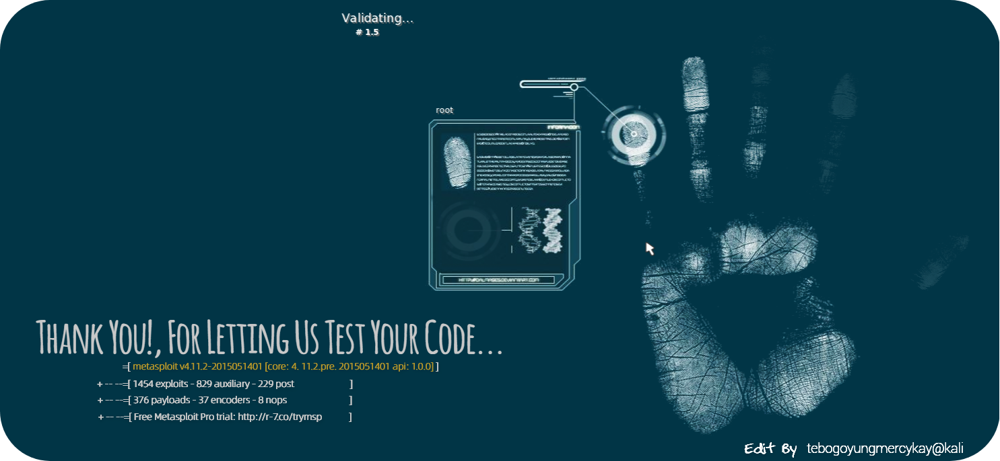

<h1 align="center">
  
</h1>



---

<h1 align=center>Personal Profile</h1>

As a Software Developer with experience in AWS Cloud Development, Full-Stack Development, DevOps, Database Management, and Testing, I apply my problem-solving skills to address real-world challenges. My interest in Cyber Security and Ethical Hacking has broadened my knowledge and skills, enabling me to deliver secure digital solutions. I'm also intrigued by Data Science, where I use data to derive valuable insights and inform decisions. Outside of technology, I engage in chess, art, and design, which contribute to my strategic thinking and creativity. My diverse interests and expertise allow me to make a meaningful impact through innovative solutions. This diverse skill set makes me a valuable addition to any team, ready to contribute and learn in a dynamic environment.

Additionally, as a STARS Mentor at the University of Pretoria, I guide and inspire aspiring minds on their educational and professional journeys. As Martin Luther King, Jr. once said, "Life's most persistent and urgent question is, what are you doing for others?" Mentoring is a way to contribute to others by dedicating yourself to your mentee's well-being. Since I enrolled in the STARS mentorship, I have a better appreciation for the importance of mentorship.

<p align="center">
  
</p>

---

<h1 align=center>Professional Skills</h1>

```python
import json

proficient_json = json.dumps({
    "Languages": ["C++", "Java", "Python", "JavaScript", "C#", "PHP", "Node.js", "Typescript"],
    "Front-End  Tools": [
        "Angular", "React", "Ionic", "Bootstrap",
        "jQuery", "NextJS", "Tailwind CSS"
    ],
    "Back-End Tools": ["Node.js", "Express.js", "Django", "FastAPI", "Flask"],
    "Web Technologies": ["JSON", "AJAX", "HTML & CSS", "Markdown", "Socket.io"],
    "Databases": ["MySQL", "MongoDB", "NeDB", "PostgreSQL", "Microsoft SQL Server"],
    "AWS Services": [
        "AWS", "S3 Bucket", "DynamoDB", "AWS Lambda", "XRAY",
        "API Gateway", "AWS Elastic Beanstalk", "Amazon EC2",
        "AWS CloudFormation", "AWS IAM (AWS Identity and Access Management)"
    ],
    "Development Tools": [
        "phpMyAdmin", "Docker", "Continuous Integration and Continuous Delivery (CI/CD)",
        "CircleCI", "SSMS"
    ],
    "Terminals": ["CMD", "Kali Linux", "Bash", "WSL", "PowerShell", "Ubuntu"],
    "Web Frameworks": ["Django", "Flask", "Node.js with Express", "PHP"]
}, indent=4)
```
<details>
  <summary> :lock: Skill Icons</summary>
  <br/>
  <div align="center">
    <details>
      <summary><b>Languages</b></summary>
      <table>
        <tr>
          <td align="center" width="100"><br>C++</td>
          <td align="center" width="100"><br>Java</td>
          <td align="center" width="100"><br>Python</td>
          <td align="center" width="100"><br>JavaScript</td>
          <td align="center" width="100"><br>PHP</td>
          <td align="center" width="100"><br>C#</td>
        </tr>
      </table>
    </details>
    <details>
      <summary><b>Front-End Tools</b></summary>
      <table>
        <tr>
          <td align="center" width="100"><br>Angular</td>
          <td align="center" width="100"><br>React</td>
          <td align="center" width="100"><br>NextJS</td>
          <td align="center" width="100"><br>Bootstrap</td>
          <td align="center" width="100"><br>Tailwind CSS</td>
          <td align="center" width="100"><br>jQuery</td>
        </tr>
      </table>
    </details>
    <details>
      <summary><b>Back-End Tools</b></summary>
      <table>
        <tr>
          <td align="center" width="100"><br>Node.js</td>
          <td align="center" width="100"><br>Django</td>
          <td align="center" width="100"><br>FastAPI</td>
          <td align="center" width="100"><br>Express.js</td>
          <td align="center" width="100"><br>Flask</td>
        </tr>
      </table>
    </details>
    <details>
      <summary><b>Web Technologies</b></summary>
      <table>
        <tr>
          <td align="center" width="100"><br>HTML</td>
          <td align="center" width="100"><br>CSS</td>
          <td align="center" width="100"><br>JSON</td>
          <td align="center" width="100"><br>AJAX</td>
          <td align="center" width="100"><br>Markdown</td>
          <td align="center" width="100"><br>Socket.io</td>
        </tr>
      </table>
    </details>
    <details>
      <summary><b>Databases</b></summary>
      <table>
        <tr>
          <td align="center" width="100"><br>MySQL</td>
          <td align="center" width="100"><br>MongoDB</td>
          <td align="center" width="100"><br>PostgreSQL</td>
          <td align="center" width="100"><br>SQL Server</td>
          <td align="center" width="100"><br>SQLite</td>
        </tr>
      </table>
    </details>
    <details>
      <summary><b>AWS Services</b></summary>
      <table>
        <tr>
          <td align="center" width="100"><br>AWS</td>
          <td align="center" width="100"><br>S3 Bucket</td>
          <td align="center" width="100"><br>Lambda</td>
          <td align="center" width="100"><br>DynamoDB</td>
          <td align="center" width="100"><br>EC2</td>
          <td align="center" width="100"><br>API Gateway</td>
        </tr>
      </table>
    </details>
  </div>
  <br/>
</details>

<h4 align="center">
  <a href="https://github.com/TebogoYungMercykay/Programming-Languages-Coding-Booth">Code Snippet From: Imperative Programming Languages</a>
</h4>
                                         
```COBOL
000100 IDENTIFICATION DIVISION.                                         -- Program metadata
000200 PROGRAM-ID. statistics_program.                                  -- Program name
000300 DATA DIVISION.                                                   -- Start of data declaration
000400 WORKING-STORAGE SECTION.                                         -- Variables available throughout the program
000500     01  arr             OCCURS 5 TIMES PIC 9.                    -- Array to hold 5 integers
000600     01  smallest        PIC 9.                                   -- Variable to hold the smallest number
000700     01  largest         PIC 9.                                   -- Variable to hold the largest number
000800     01  mode_value      PIC 9.                                   -- Variable to hold the mode
000900     01  i               PIC 9.                                   -- Loop counter for various loops
001000     01  j               PIC 9.                                   -- Loop counter for nested loops
001100     01  COUNTER         PIC 9.                                   -- Counter for mode calculation
001200     01  max_count       PIC 9.                                   -- Variable to hold the maximum count
```


<a></a>
<a></a>

---

<h1 align=center>Contact Details</h1>

- WhatsApp/Mobile: +27 66 411 0178
- Email: sbkskhalo.kq@gmail.com
- `LinkedIn Profile`: [sello-selepe](https://www.linkedin.com/in/sello-selepe-tebogoyungmercykay/)

---

<p align="center">
  
</p>
