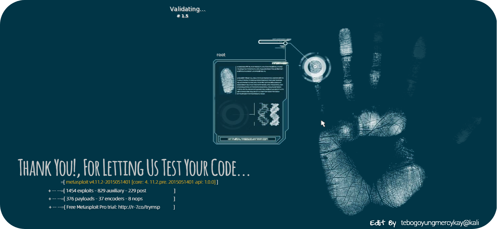

<h1 align="center">
  
</h1>



---

<h1 align=center>SUMMARY</h1>

Computer Science graduate and active open-source contributor specializing in building secure, scalable, high-performance solutions. My expertise spans Software Engineering, DevOps, AWS Cloud Development, Web Development, Database Management, and Software Testing, with a strong focus on end-product delivery and collaborative development.

Driven by a passion for Cybersecurity and Data Science, I thrive in dynamic environments that foster innovation and continuous learning. I am committed to delivering cutting-edge solutions that solve real-world challenges, meet evolving industry demands, and create meaningful impact through technology.

<p align="center">
  
</p>

---

<h1 align="center">DEV TOOLS</h1>

<div align="center">

<table>
  <tr>
    <td><b>Languages & Core</b></td>
    <td></td>
  </tr>
  <tr>
    <td><b>Frontend</b></td>
    <td></td>
  </tr>
  <tr>
    <td><b>Backend</b></td>
    <td></td>
  </tr>
  <tr>
    <td><b>Databases</b></td>
    <td></td>
  </tr>
  <tr>
    <td><b>Cloud & DevOps</b></td>
    <td></td>
  </tr>
  <tr>
    <td><b>Tools & Testing</b></td>
    <td></td>
  </tr>
</table>

</div>

<h4 align="center">
  <a href="https://github.com/TebogoYungMercykay/Programming-Languages-Coding-Booth">Code Snippet From: Imperative Programming Languages</a>
</h4>

```COBOL
000100 IDENTIFICATION DIVISION.                                         -- Program metadata
000200 PROGRAM-ID. statistics_program.                                  -- Program name
000300 DATA DIVISION.                                                   -- Start of data declaration
000400 WORKING-STORAGE SECTION.                                         -- Variables available throughout the program
000500     01  arr             OCCURS 5 TIMES PIC 9.                    -- Array to hold 5 integers
000600     01  smallest        PIC 9.                                   -- Variable to hold the smallest number
000700     01  largest         PIC 9.                                   -- Variable to hold the largest number
000800     01  mode_value      PIC 9.                                   -- Variable to hold the mode
000900     01  i               PIC 9.                                   -- Loop counter for various loops
001000     01  j               PIC 9.                                   -- Loop counter for nested loops
001100     01  COUNTER         PIC 9.                                   -- Counter for mode calculation
001200     01  max_count       PIC 9.                                   -- Variable to hold the maximum count
```

<a></a>
<a></a>

<p align="center">
  
</p>

---
<h1 align="center">CONTACT ME</h1>

I'm always open to discussing new projects, opportunities, or collaborations.

- **WhatsApp/Mobile:** +27 66 411 0178
- **Email:** [sbkskhalo.kq@gmail.com](mailto:sbkskhalo.kq@gmail.com)
- **Website:** [tebogoyungmercykay.co.za](https://www.tebogoyungmercykay.co.za)
- **LinkedIn Profile:** [in/sello-selepe-tebogoyungmercykay](https://www.linkedin.com/in/sello-selepe-tebogoyungmercykay/)

---
